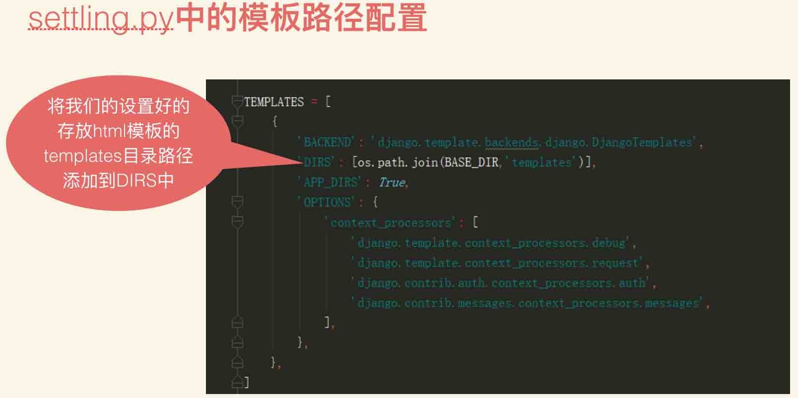
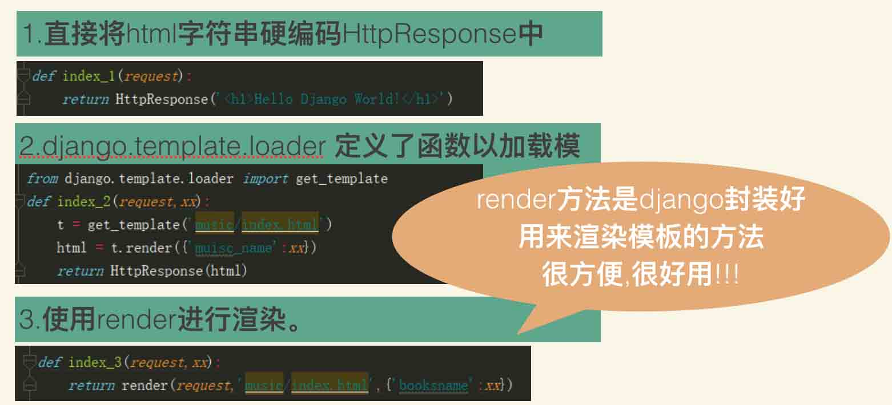
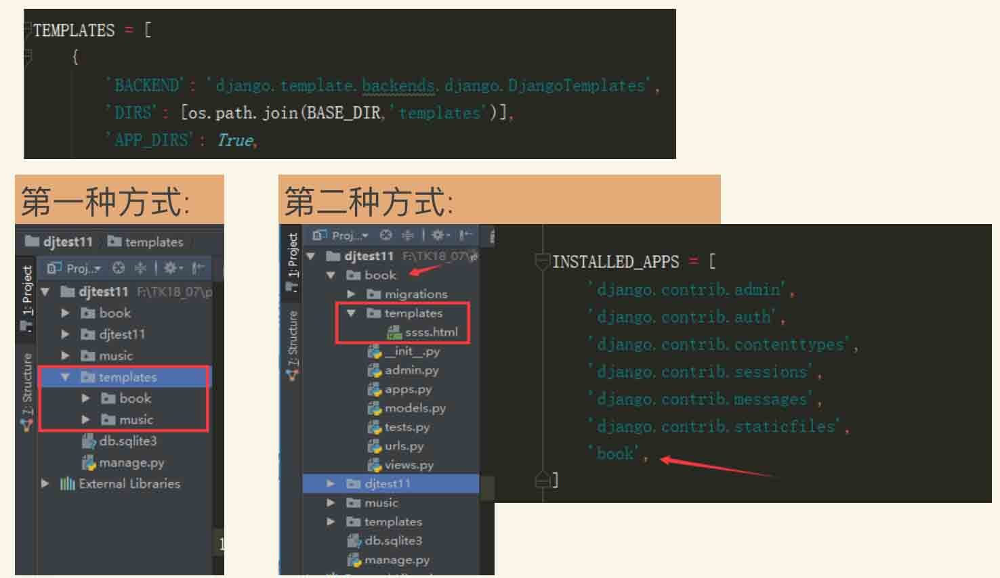

# 4.模板
### 4.1.模板放在哪

* 1.在主目录下创建一个templates目录用来存放所有的html的模板文件.
* 2.templates目录里面在新建各个以app名字命名的目录来存放各个app中模板文件.




**模板渲染实例**

在app目录views.py文件编写渲染代码
```
from django.shortcuts import render
from django.http import HttpResponse
from django.template.loader import get_template

#index方法渲染模板
def index(request):
    return HttpResponse('<h1>这是blog主页<h1>')
#index1方法渲染模板
def index1(request):
    t = get_template('blog/blog_index.html')
    html = t.render({'name':'taka'})
    return HttpResponse(html)
#index2方法渲染模板
def index2(request):
    return render(request,'blog/blog_index.html',context={'name':'taka'})
#context是传参数内容的方法
```

**在app目录urls.py文件内编写路由**
```
from django.urls import path
from . import views

urlpatterns = [
    path('/index/',views.index),
    path('/index1/',views.index1),
    path('/index2/',views.index2),
    ]
```

**在templates目录下建立blog目录并建立blog_index.html文件**
```
<!DOCTYPE html>
<html lang="en">
<head>
    <meta charset="UTF-8">
    <title>Title</title>
</head>
<body>
这是blog主页 {{ name }}
</body>
</html>

```

-------------------------------------------------------------------------

### 4.2.模板路径配置及变量
* 模板路径
* 模板变量
* 常用的过滤器
* 静态文件引用

-------------------------------------------------------------------------

#### 4.2.1.模板路径配置


-------------------------------------------------------------------------

* 在配置文件setting.py中找到TEMPLATES设置来配置。
* 这是一个设置选项的列表，模板大都包含两项通用设置；两种方式配置模板:

第一种: DIRS 定义一个目录列表，模板引擎按列表顺序搜索这些目录以查找模板源文件。将templates放在主项目目录下。

第二种: APP_DIRS告诉模板引擎是否应该进入每个已安装的应用中查找模板,值为True则模板会去安装了的app下面的templates文件夹查找模板。。所以我们也可以在每个app的里面创建模板目录templates存放模板,这种方式需要将这个app添加到setting.py文件的INSTALLED_APPS列表中。

-------------------------------------------------------------------------------
**4.2.2.模板变量的引入**


**模板变量使用规则**

1. 语法:   {{ 变量名 }}
2. 命名由字母和数字以及下划线组成，不能有空格和标点符号
3. 可以使用字典、模型、方法、函数、列表
4. 不要和python或django关键字重名
5. 变量和查找

**注:**

1. 如果data是一个字典，那么访问data.items将会访问data这个字典的key名为items的值，而不会访问字典的items方法。
2. 点在模板渲染时有特殊的含义。 变量名中点表示查找。 

**模板变量例子**

1. app blog/views.py文件
```
from django.shortcuts import render
from django.http import HttpResponse
from django.template.loader import get_template

def hello():
    return 'django'
class Fruits:
    def __init__(self,name, color):
        self.name = name
        self.colo = color
    def say(self):
        return 'HAHAHAHA'

ap = Fruits('apple','red')
ls = ['x','y','z']
dc = {'a':1,'b':2}

def index(request):
    return HttpResponse('<h1>这是blog主页<h1>')

def index1(request):
    t = get_template('blog/blog_index.html')
    html = t.render({'name':'taka'})
    return HttpResponse(html)

def index2(request):
    return render(request,'blog/blog_index.html',
                  context={
                      'name':'python',     # 字符串
                      'hello':hello,       # 函数
                      'fruits_say':ap.say, # 方法
                      'fruits':ap,         # 类对象
                      'list':ls,           # 列表
                      'dict':dc,           # 字典
                  })
```

2. /templates/blog/blog_index.html文件
```
<!DOCTYPE html>
<html lang="en">
<head>
    <meta charset="UTF-8">
    <title>Title</title>
</head>
<body>
这个变量是字符串对象 {{ name }}<br>
这个变量是函数对象 {{ hello }}<br>
这个变量是类对象 {{ fruits_say }}<br>
这个变量是类{{ fruits }} <br>
这个变量是列表对象 {{ list }} <br>
这个变量是字典对象 {{ dict }}<br>
</body>
</html>
```

-------------------------------------------------------------------------------
### 4.3.过滤器

作用: 对变量进行过滤。在真正渲染出来之前，过滤器会根据功能处理好变量，然后得出结果后再替换掉原来的变量展示出来。

**语法：**`{{fruits|lower}}`

管道符号进行链式调用，比如实现一个功能，先把所有字符变成小写，把第一个字符转换成大写。

**语法：**`{{fruits|lower|capfirst}}`

使用参数:过滤器可以使用参数，在过滤器名称后面使用冒号”:”再加上参数，比如要把一个字符串中所有的空格去掉，则可以使用cut过滤器,

**语法如下: **`{{fruits|cut:" "}}`

**注意：**
使用参数的时候，冒号和参数之间不能有任何空格，一定要紧挨着。

**常用过滤器**

1. add:`字符串相加，数字相加，列表相加，如果失败，将会返回一个空字符串`
2. default:`提供一个默认值，在这个值被django认为是False的时候使用。比如：空字符串、None。区别于default_if_none,这个只有在变量为None的时候才使用默认值。`
3. first:`返回列表中的第一个值`
4. last:`返回列表中的最后一个值`
5. date:`格式化日期和时间`
6. time:`格式化时间`
7. join:`跟python中的join一样的用法`
8. length:`返回字符串或者是数组的长度`
9. length_is:`字符串或者是数组的长度是否是指定的值`
10. lower:`把所有字符串都变成小写`
11. truncatechars:`根据后面给的参数，截断字符，如果超过了用...表示`
12. truncatewords:`同truncatechars，截断标签中的字符，而不会截断标签以上两个有xxx_html类似的，针对html，截断标签中的字符，而不会截断标签`
13. capfirst:`首字母大写`
14. slice:`切割列表。用法跟python中的切片操作是一样的，区间是前闭后开放`
15. striptags:`去掉所有的html标签`
16. safe:`关闭变量的自动转移`
17. floatformat:`浮点数格式化`

**date和time过滤器格式**

1. Y:`四位数的年` 如:`1999`
2. y:`两位数的年` 如:`99`
3. m:`两位数的月` 如:`01，09`
4. n:`一位数的月` 如:`1，9，12`
5. d:`两位数的日` 如:`01，09，31`
6. j:`一位数的日` 如:`1，9，31`
7. g:`12小时制的一位数的小时` 如:`1，9.12`
8. G:`24小时制的一位数的小时` 如:`0，8，23`
9. h:`12小时制的两位数的小时` 如:`01，09，12`
10. H:`12小时制的两位数的小时` 如:`01，13，24`
11. i:`分钟` 从00-59
12. s:`秒` 从00-59

**过滤器的例子**

在views.py文件内编辑如下代码
```
from django.shortcuts import render
from django.http import HttpResponse
from django.template.loader import get_template

def hello():
    return 'django'
class Fruits:
    def __init__(self,name, color):
        self.name = name
        self.colo = color
    def say(self):
        return 'HAHAHAHA'

ap = Fruits('apple','red')
ls = ['x','y','z']
dc = {'a':1,'b':2}

def index(request):
    return HttpResponse('<h1>这是blog主页<h1>')

def index1(request):
    t = get_template('blog/blog_index.html')
    html = t.render({'name':'taka'})
    return HttpResponse(html)

def index2(request):
    return render(request,'blog/blog_index.html',
                  context={
                      'name':'python',     # 字符串
                      'hello':hello,       # 函数
                      'fruits_say':ap.say, # 方法
                      'fruits':ap,         # 类对象
                      'list':ls,           # 列表
                      'dict':dc,           # 字典
                  })
```
在模板目录下创建一个test.html文件代码如下
```
<!DOCTYPE html>
<html lang="en">
<head>
    <meta charset="UTF-8">
    <title>Title</title>
</head>
<body>
这个变量是字符串对象 {{ name }}<br>
这个变量是函数对象 {{ hello }}<br>
这个变量是类对象 {{ fruits_say }}<br>
这个变量是类{{ fruits }} <br>
这个变量是列表对象 {{ list|last }} <br>
这个变量是字典对象 {{ dict }}<br>
</body>
</html>
```

### 4.4.关于自动转义
* **什么是自动转义**

自动转义是将变量的一些特殊字符，比如左箭头（<）、右箭头（>）转义成html代码，这样做的目的是为了处理一些不安全的变量。

(<):转义成 (&lt);

(>): 转义成 (&gt);

(‘):转义成 (&#39);

(“):转义成 (&quot);

(&):转义成 (&amp);

### 4.5. 静态路径


